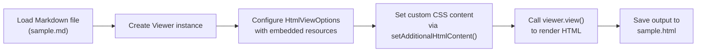

# View Markdown Files with CSS Styling Using GroupDocs Viewer for Java

This repository demonstrates rendering Markdown documents to HTML with real-time CSS styling applied in the viewer using GroupDocs Viewer for Java.

## Overview

Markdown is widely used for documentation, blogs, and technical writing, but its plain-text format lacks visual styling. GroupDocs Viewer for Java enables developers to convert Markdown files into rich HTML with embedded CSS, preserving formatting and applying custom styles in real time. This example shows how to:

- Load a Markdown file from local disk
- Render it to HTML with embedded resources
- Inject custom CSS for consistent styling
- Save the output for web or desktop viewing

The result is a fully styled HTML file ready for integration into web applications, documentation portals, or internal tools.

## How it works



**Important:** Ensure your input Markdown file (`sample.md`) exists under `src/main/resources/input/` before running the demo. The example does not include sample input files — you must provide your own.

## Topics covered

- View Markdown files with real-time CSS styling applied in the viewer.

## Prerequisites

- Java 8 or higher
- Maven 3.x or higher
- Internet access (to download GroupDocs Viewer from the GroupDocs repository)

## License

GroupDocs Viewer is a commercial product. You can:

- Get a [free 30-day temporary license](https://purchase.groupdocs.com/temporary-license) to test full functionality.
- Review the [official documentation](https://docs.groupdocs.com/viewer/java/) for detailed API usage.

## Setup & Run

1. Clone this repository.
2. Place your Markdown file at `src/main/resources/input/sample.md`.
3. Run the demo:

```bash
mvn compile exec:java
```

The output HTML file will be saved at `src/main/resources/output/sample.html`.

## FAQ

**Q: Can I apply external CSS files instead of inline styles?**
A: Yes. Use `HtmlViewOptions.forEmbeddedResources()` and set `setCssResourcesPrefix()` to reference external CSS files. You can also write CSS to separate files and link them manually in `setAdditionalHtmlContent()`.

**Q: Does this work with password-protected Markdown files?**
A: Markdown files are typically not encrypted. If your Markdown is embedded in a container (e.g., ZIP), use `LoadOptions` with a password before rendering.

**Q: Is CSS injection compatible with all browsers?**
A: Yes. The injected `<style>` block uses standard CSS and is fully supported in modern browsers.

For more details, see the [GroupDocs Viewer for Java documentation](https://docs.groupdocs.com/viewer/java/).
